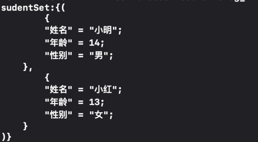
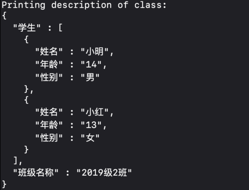

# NSSetUTF8Log

[](https://travis-ci.org/oovsxx@163.com/NSSetUTF8Log)
[](https://cocoapods.org/pods/NSSetUTF8Log)
[](https://cocoapods.org/pods/NSSetUTF8Log)
[](https://cocoapods.org/pods/NSSetUTF8Log)

NSSetUTF8Log是一款小工具，通过hook原本的description方法，支持NSDictionary、NSArray和NSSet在Xcode控制台中打印时输出中文(UTF8)字符，使用时将源文件加入工程即可，不需要import，也不需要额外的代码。

## 安装说明

NSSetUTF8Log支持通过 [CocoaPods](https://cocoapods.org) 安装，相关代码只在Debug环境下才被编译，推荐只在Debug环境中使用：

```ruby
pod 'NSSetUTF8Log' :configurations => ['Debug']
```

## 使用示例

示例工程在运行前需在  Example 文件夹下先执行`pod install`。**如果NSDictionary和NSArray是Json对象，会在打印时按Json格式输出。**

支持NSLog时的输出：


也支持断点调试时的打印：


## 许可协议

NSSetUTF8Log 支持 MIT 许可协议，详情见 LICENSE 文件。
